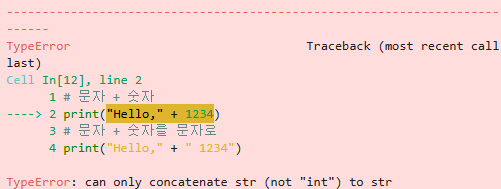

# 파이썬 기초

## Print 기초


```python
# 문자
print("Hello, World!")
# 숫자
print(1234)
```

    Hello, World!
    1234


```python
# 문자 + 문자
print("Hello," + " World!")
# 숫자 + 숫자
print(1234 + 5678)
```

    Hello, World!
    6912


```python
# 문자 + 숫자
# print("Hello," + 1234)
# 문자 + 숫자를 문자로
print("Hello," + " 1234")
```

    Hello, 1234


- **문자 + 숫자 에러**




```python
# 문자 * 숫자
print("Hello " * 5)
```

    Hello Hello Hello Hello Hello 


<hr/>


```python
# print 심화1
print("=" * 30, end='') # 마지막에 end='' 를 이용하여 엔터를 삭제함
print("Hello" * 5, end='')
print("=" * 30, end='')
```

    ==============================HelloHelloHelloHelloHello==============================


```python
# print 심화2
print("Hello","World", sep='-')
print(1,2,3,4,5, sep='/')
```

    Hello-World
    1/2/3/4/5


<hr/>


```python
# print 응용1
import time as t
print("Hello")
t.sleep(1)
print("World")
t.sleep(1)
```

    Hello
    World


```python
# print 응용2
import time as t
print("Now Loading.", end='\r')
t.sleep(1)
print("Now Loading..", end='\r')
t.sleep(1)
print("Now Loading...", end='\r')
t.sleep(1)
```

    Now Loading...

## 숫자형


```python
# 정수형
a = 123
b = -321
c = 0

print(a)
print(b)
print(c)
```

    123
    -321
    0


```python
# 실수형
aa = 3.141592
bb = -12.34
cc = 3.14E10
dd = 3.14E-10
ee = 2**10

print(aa)
print(bb)
print(cc)
print(dd)
print(ee)
```

    3.141592
    -12.34
    31400000000.0
    3.14e-10
    1024


```python
# 2진수(bin)
aaa = 0b1101
# 8진수(oct)
bbb = 0o177
# 16진수(hex)
ccc = 0x8ff

print(aaa)
print(bbb)
print(ccc)
```

    13
    127
    2303


```python
a1 = 5
a2 = 7

print(a1**a2)
```

    78125


<table>
<thead>
<tr>
<th>항목</th>
<th>파이썬 사용 예</th>
</tr>
</thead>
<tbody>
<tr>
<td>정수</td>
<td>123, -345, 0</td>
</tr>
<tr>
<td>실수</td>
<td>123.45, -1234.5, 3.4e10</td>
</tr>
<tr>
<td>8진수</td>
<td>0o34, 0o25</td>
</tr>
<tr>
<td>16진수</td>
<td>0x2A, 0xFF</td>
</tr>
</tbody>
</table>

## 사칙 연산


```python
# 사칙 연산 예
b1 = 77
b2 = 13

print('덧셈:',b1 + b2)
print('뺄셈:',b1 - b2)
print('곱셈:',b1 * b2)
print('나눗셈:',b1 / b2)
print('몫:',b1 // b2)
print('나머지:',b1 % b2)
print('승:',b1 ** b2)
```

    덧셈: 90
    뺄셈: 64
    곱셈: 1001
    나눗셈: 5.923076923076923
    몫: 5
    나머지: 12
    승: 3344871416191195940889917


```python
# 복합 연산자
a = 1 # 초기값

a = a + 1
a += 1

print(a)
```

    3

