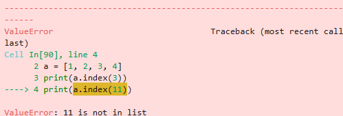

```python
print("{{}}".format())
```

    {}


```python
n = "a"
m = 30
print(f"{"hi"} {"bye"}")
print(f"{n} {m+1}")
```

    hi bye
    a 31


```python
d = {'name':"홍길동", 'age':30}
# f포매팅 주의할 점
# 딕셔너리의 값을 표현할 때 괄호로 묶어 표기하고 공백을 주의하라
print(f"{(d['name']):<10} {(d['age']):^20}") # 괄호가 들어가야 함
```

    홍길동                 30         


```python
# f문자열을 사용하여 세자리 콤마 찍기
btc = 75000
ssum = btc * 1450
f"{ssum:,}"
```


    '108,750,000'


### 문자열 관련 함수들


```python
# count - 문자 개수 세기
a = "hobby"
b = "appleeee"
print(a.count("b"))
print(b.count("e"))
```

    2
    4


```python
# find - 위치 알려 주기
a = "Python is the best choice"
print(a.find('b'))
print(a.find('P'))
print(a.find('x'))
```

    14
    0
    -1


```python
# index - 위치 알려 주기 2
a = "Life is too short"
print(a.index('t'))
# print(a.index('z')) 찾는 값이 없으면 오류 발생
```

    8


**오류 발생**
</br>
</img>


```python
# join - 문자열 삽입
ss = 'abcdefg'
print("-".join(ss))
print("a","b","c", sep="-")
```

    a-b-c-d-e-f-g
    a-b-c


```python
# a*b*c*d*e*f*g
print("*".join(ss))
```

    a*b*c*d*e*f*g


```python
# upper - 소문자를 대문자로 바꾸기
a = "Python is the best choice"
print(a.upper())
# Lower - 대문자를 소문자로 바꾸기
b = "Python is the best choice"
print(b.lower())
c = "Python is the best choice"
print(c[0] + c[1:].lower())
```

    PYTHON IS THE BEST CHOICE
    python is the best choice
    Python is the best choice


```python
ss = f"{'hi':^12}"
print(ss)
# lstrip - 왼쪽 공백 지우기
print(ss.lstrip())
# rstrip - 오른쪽 공백 지우기
print(ss.rstrip())
# strip - 양쪽 공백 지우기
print(ss.strip())
```

         hi     
    hi     
         hi
    hi


```python
# replace - 문자열 바꾸기 **
a = "Life is too short"
a = a.replace("Life", "Your leg") # "Life" 라는 문자열을 "Your leg" 라는 문자열로 바꿈
print(a)
```

    Your leg is too short


```python
# split - 문자열 나누기 **
a = "Life is too short"
print(a.split()) # 공백을 기준으로 나누어 리스트에 담음
a = "Life:is:too:short"
print(a.split(":")) # ":"을 기준으로 나누어 리스트에 담음
```

    ['Life', 'is', 'too', 'short']
    ['Life', 'is', 'too', 'short']


```python
# BaNaNa -> banana -> b*a*n*a*n*a -> ['b', 'a', 'n', 'a', 'n', 'a']
a = "BaNaNa"
print(("*".join(a.lower())).split("*"))
```

    ['b', 'a', 'n', 'a', 'n', 'a']


```python
# isalpha - 문자열이 알파벳으로만 구성되어 있는지 확인하기
s = "Life is too short"
print(s.replace(" ", "").isalpha()) # replace로 공백을 없애고 검사
```

    True


```python
# isdigit - 문자열이 숫자로만 구성되어 있는지 확인하기
n = "1234.56" # 실제 정수값이 아니라 문자열 내에 있는 숫자를 검사
print(n.replace(".", "").isdigit())
```

    True


```python
s = "Life is too short"
print(s.startswith("Life"))
print(s.startswith("short"))
```

    True
    False


```python
s = "Life is too short"
print(s.endswith("short"))
print(s.endswith("Life"))
```

    True
    False


# 주요 자료형

## 리스트 자료형


```python
# 리스트 만들기
odd = [1, 3, 5, 7, 9]
```


```python
# 리스트 중요한 점, 순서! index!
a = []
b = [1, 2, 3]
c = ['Life', 'is', 'too', 'short']
d = [1, 2, 'Life', 'is']
e = [1, 2, ['Life', 'is']]
```


```python
s = "spring"
s[0]
a = [11, 22, 33, 44, 55]
print(a[0] + a[3])
```

    55


```python
a = "banana"
b = a
print(id(a))
print(id(b)) # a와 b의 주소값이 다름
b = "kiwi"
print(id(a)) # a와 b의 주소값이 다름
print(id(b)) # a와 b의 주소값이 다름
```

    130813302943888
    130813302943888
    130813302943888
    130813302944800


```python
aa = [11, 22, 33]
print(id(aa))
bb = aa
print(id(bb))
bb[0] = 33
print(id(aa))
print(id(bb))
# 리스트 객체가 메모리에 생성되고 aa는 그 객체를 참조
# bb = aa 는 새로운 리스트를 만드는 것이 아닌 aa가 참조하는 객체를
# bb도 참조하기에 이런 결과가 나온 것
# 같은 리스트를 참조하는 다른 이름인 것
```

    130813302954304
    130813302954304
    130813302954304
    130813302954304


```python
aa = [11, 22, 33]
# bb = aa.copy()
# bb = list(aa)
bb = aa[:]
print(id(aa))
print(id(bb))
```

    130813297295808
    130813297317440


```python
# 배열 초기화
cc = []
print(cc, type(cc))
dd = list()
print(dd, type(dd))
```

    [] <class 'list'>
    [] <class 'list'>


```python
# 2중 배열
li = [1, 2, 3, 4, [11, 22, 33]]
print(li)
print(li[4])
print(li[-1]) # 맨 뒷 부분
print(li[4][2])
```

    [1, 2, 3, 4, [11, 22, 33]]
    [11, 22, 33]
    [11, 22, 33]
    33


```python
# 삼중 리스트
a = [1, 2, 3, ['a', 'b', 'c', ['ok', 'Life', 'is']]]
print(a[3][3][1])
```

    Life


```python
# 리스트의 슬라이싱
a = [11, 22, 33, 44, 55]
print(a[:2])
print(a[1:3])
print(a[2:])
```

    [11, 22]
    [22, 33]
    [33, 44, 55]


```python
# 중첩된 리스트에서 슬라이싱 하기
a = [1, 2, ['0', '1', 'a', 'b', 'c'], 4, 5]
print(a[2][2:])
```

    ['a', 'b', 'c']


```python
# 리스트 더하기
a = [1, 2, 3]
b = [4, 5, 6]
print(a + b)
```

    [1, 2, 3, 4, 5, 6]


```python
# 리스트 반복
c = a * 4
print(c, len(c))
```

    [1, 2, 3, 1, 2, 3, 1, 2, 3, 1, 2, 3] 12


```python
# 리스트의 수정과 삭제
a = [11, 22, 33]
b = a.copy() # 옅은 복사를 실행하여 원본을 복사
b[2] = 777
print(a)
print(b)
```

    [11, 22, 33]
    [11, 22, 777]


```python
# 요소 삭제 *
aa = [11, 22, 33, 44, 55]
del aa[2]
print(aa)
```

    [11, 22, 44, 55]


```python
# 요소 삭제2(슬라이싱)
aa = [11, 22, 33, 44, 55]
del aa[1:3]
print(aa)
```

    [11, 44, 55]


### 리스트 관련 함수


```python
# append - 추가하기 *
a = []
a.append(1)
print(a)
a.append(2)
print(a)
a.append([11, 22, 33])
print(a)
a.append(4)
print(a)
```

    [1]
    [1, 2]
    [1, 2, [11, 22, 33]]
    [1, 2, [11, 22, 33], 4]


```python
# sort - 리스트 정렬
a = [5 ,24 ,75, 2, 43, 36 ,93]
b = ['gf', 'f', 'u', 'a', 'e', 'f', 'z', 'c']
a.sort()
b.sort()
print(a)
print(b)
```

    [2, 5, 24, 36, 43, 75, 93]
    ['a', 'c', 'e', 'f', 'f', 'gf', 'u', 'z']


```python
# reverse - 리스트 뒤집기
a = [5 ,24 ,75, 2, 43, 36 ,93]
b = ['gf', 'f', 'u', 'a', 'e', 'f', 'z', 'c']
# 원본 훼손 X
print(a[::-1])
print(b[::-1])
# 원본 훼손
a.reverse()
b.reverse()
print(a)
print(b)
```

    [93, 36, 43, 2, 75, 24, 5]
    ['c', 'z', 'f', 'e', 'a', 'u', 'f', 'gf']
    [93, 36, 43, 2, 75, 24, 5]
    ['c', 'z', 'f', 'e', 'a', 'u', 'f', 'gf']


```python
# sort와 reverse 응용
a = [5 ,24 ,75, 2, 43, 36 ,93]
a.sort()
a.reverse() # a[::-1]
print(a)

b = [5 ,24 ,75, 2, 43, 36 ,93]
b.sort(reverse=True) # True는 내림차순, False는 오름차순이 기본값
print(b)

# sort, reverse는 반환값 없음(결과: None)
print(a.sort())
print(a.reverse())
```

    [93, 75, 43, 36, 24, 5, 2]
    [93, 75, 43, 36, 24, 5, 2]
    None
    None


```python
# sorted - 원본 유지하기
aa = [66, 7, 8, 99, 0]
print(sorted(aa))
print(sorted(aa, reverse=True))
print(aa)
```

    [0, 7, 8, 66, 99]
    [99, 66, 8, 7, 0]
    [66, 7, 8, 99, 0]


```python
# sorted 응용하기
fruit = ["apple", "banana", "orange", "kiwi", "strawberry"]
print(sorted(fruit, key=len)) # 문자열의 길이 기준으로 정렬
print(sorted(fruit, key=len, reverse="True"))
```

    ['kiwi', 'apple', 'banana', 'orange', 'strawberry']
    ['strawberry', 'banana', 'orange', 'apple', 'kiwi']


```python
# index - 인덱스반환
a = [1, 2, 3, 4]
print(a.index(3))
# print(a.index(11))
```

    2


**없으면 오류**




```python
# index 응용
fruit = ["apple", "banana", "orange", "kiwi", "strawberry"]
inp = input("좋아하는 과일")
# melon 을 선택 -> melon 인덱스 추출
n = fruit.index(inp)
print(f"{inp}을 좋아하시는 군요. {n + 1} 번째에 있습니다")
```

    좋아하는 과일 apple


    apple을 좋아하시는 군요. 1 번째에 있습니다


```python
# insert - 리스트에 요소 삽입 *
a = [1, 2, 3 ,4 ,5 ,6]
a.insert(0, 77) # 원래 그 자리에 있던 요소는 뒤로 밀고 삽입
print(a)
a.insert(3, 177)
print(a)
a.insert(5, [1, 2, 3])
print(a)
a.insert(len(a), 11177) # 배열 맨 뒤에 추가하려면 len() 함수가 편함
print(a)
```

    [77, 1, 2, 3, 4, 5, 6]
    [77, 1, 2, 177, 3, 4, 5, 6]
    [77, 1, 2, 177, 3, [1, 2, 3], 4, 5, 6]
    [77, 1, 2, 177, 3, [1, 2, 3], 4, 5, 6, 11177]


```python
# remove 리스트 요소 제거
a = [1, 2, 3] * 3 
a.remove(2) # 인덱스 가장 앞에 있는 그 값을 삭제
print(a)
```

    [1, 3, 1, 2, 3, 1, 2, 3]


```python
# pop 리스트 요소 꺼내기 **
a = [1, 2, 3, 4, 5]
out = a.pop(0) # 값을 넣으면 인덱스의 요소를 반환하고 그 요소는 삭제
print(out, a) # 값이 없을 때(기본값)는 맨 뒤에서 부터 꺼내면서 삭제
out = a.pop(0)
print(out, a)
out = a.pop(0)
print(out, a)
out = a.pop(0)
print(out, a)
out = a.pop(0)
print(out, a)
```

    1 [2, 3, 4, 5]
    2 [3, 4, 5]
    3 [4, 5]
    4 [5]
    5 []


```python
# count 리스트에 포함된 요소 개수 세기
a = [2, 3, 4, 6]*2 + [1, 2, 3]*3
print(a, a.count(4))
```

    [2, 3, 4, 6, 2, 3, 4, 6, 1, 2, 3, 1, 2, 3, 1, 2, 3] 2


```python
# extend 리스트 확장
a = [1, 2, 3]
a.extend([4, 5])
print(a)
```

    [1, 2, 3, 4, 5]


### 응용 문제


```python
# 장바구니
bag = [] # bag = list()
```


```python
# append를 이용한 자료 넣기
item = input("필요한 항목을 넣어주세요")
bag.append(item)
print("장바구니에는 {0} 들이 들어 있습니다.".format(bag))
```

    필요한 항목을 넣어주세요 감자


    장바구니에는 ['사과', '사과', '바나나', '감자'] 들이 들어 있습니다.


```python
# FIFO
hand = bag.pop(0)
print("%s를 꺼내서 장바구니에 %s가 남았습니다." % (hand, bag))
```

    사과를 꺼내서 장바구니에 ['사과', '바나나']가 남았습니다.


- 선택 출력
> "바구니에 ['호박', '감자', '소주', '맥주', '치킨', '피자'] 이 있습니다."
> "꺼내고 싶은 물품을 입력하세요"
> "바구니에서 ??? 을 꺼내어 [~, ~, ~, ~] 가 남았습니다."


```python
baguni = ['호박', '감자', '소주', '맥주', '치킨', '피자']
print("바구니에 {0}이 있습니다".format(baguni))
item = input("꺼내고 싶은 물품을 입력하세요")
baguni.pop(baguni.index(item))
print("바구니에서 %s 을 꺼내어 %s 가 남았습니다." % (item, baguni))
```

    바구니에 ['호박', '감자', '소주', '맥주', '치킨', '피자']이 있습니다


    꺼내고 싶은 물품을 입력하세요 호박


    바구니에서 호박 을 꺼내어 ['감자', '소주', '맥주', '치킨', '피자'] 가 남았습니다.


```python
# 문제2
# 위치 지정 물품 추가
box = ['호박', '감자', '소주', '맥주', '치킨', '피자']
# 입력받기1: "추가할 물건 이름을 적어주세요"
# 입력받기2: "어느 물품 뒤에 넣어둘까요?"
# box 를 출력하기
item = input("추가할 물건 이름을 적어주세요")
i = input("어느 물품 뒤에 넣어둘까요?")
box.insert(box.index(i) + 1, item)
print(box)
```

    추가할 물건 이름을 적어주세요 고구마
    어느 물품 뒤에 넣어둘까요? 맥주


    ['호박', '감자', '소주', '맥주', '고구마', '치킨', '피자']
