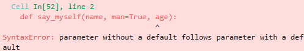

# 함수 

## 함수 기본


```python
def add(a, b):
    print(a, b)
```


```python
def add2():
    return "더했어요."
```


```python
# 매개변수
def add(a, b):
    return a + b
```


```python
add(15, 20) * 10
```


    350


```python
def tt():
    for n in range(10):
        print(n, end=" ")
        if n == 6: return
```


```python
tt()
```

    0 1 2 3 4 5 6 


```python
def intro(name):
    print(f"{name}님 안녕하세요")
```


```python
intro("박민욱")
```

    박민욱님 안녕하세요


```python
def add(a, b):
    c = a + b
    return c
```


```python
print(add(2, 5))
```

    7


## 여러가지 매개변수를 받는 함수


```python
def add_many(*args): # 순회 가능한 객체 args
    result = 0
    for i in args:
        result += i
    return result
```


```python
add_many(11, 22, 33, 44, 55)
```


    165


```python
def add_mul(*args):
    if args[0] == "add":
        result = 0
        for i in range(1, len(args)):
            result = result + i
    elif args[0] == "mul":
        result = 1
        for i in range(1, len(args)):
            result = result * i
    return result
```


```python
add_mul("add", 1, 2, 3, 4, 5)
```


    15


```python
def print_test(*args):
    print(args,type(args))
print_test(1,2,3,4,5)
```

    (1, 2, 3, 4, 5) <class 'tuple'>


## 키워드 매개변수, kwargs


```python
def print_kwargs(**kwargs):
    print(kwargs, type(kwargs))
print_kwargs(name='foo', age=3)
```

    {'name': 'foo', 'age': 3} <class 'dict'>


## 함수의 반환값은 언제나 하나이다


```python
def add_and_mul(a, b):
    # return a + b, a * b
    # return [a + b, a * b]
    return {a + b, a * b}
```


```python
value = add_and_mul(13, 12)
print(value, type(value))
```

    {25, 156} <class 'set'>


## 매개변수에 초깃값 미리 설정하기 *


```python
# default1.py
def say_myself(name, age, man=True): 
    print("나의 이름은 %s 입니다." % name) 
    print("나이는 %d살입니다." % age) 
    if man: 
        print("남자입니다.")
    else: 
        print("여자입니다.")

say_myself("홍길동", 22)
say_myself("박서방", 23, man=True)
say_myself("향단이", 24, man=False)
```

    나의 이름은 홍길동 입니다.
    나이는 22살입니다.
    남자입니다.
    나의 이름은 박서방 입니다.
    나이는 23살입니다.
    남자입니다.
    나의 이름은 향단이 입니다.
    나이는 24살입니다.
    여자입니다.


```python
# default2.py
def say_myself(name, man=True, age=True): 
    print("나의 이름은 %s 입니다." % name) 
    print("나이는 %d살입니다." % age) 
    if man: 
        print("남자입니다.") 
    else: 
        print("여자입니다.")
```

**매개변수 초기화는 마지막에 둬야한다. 초기화 뒤에 일반 매개변수가 오면 안된다**



## 함수 안에서 선언한 변수의 효력 범위 *


```python
# 함수 안에서 사용하는 매개변수는 함수 밖의 변수 이름과는 전혀 상관없다.
# 함수 안에 있는 a라는 매개변수와 함수 밖에 있는 a라는 변수는 다른 변수이다.
a = 1
def vartest(a):
    a = a + 1

vartest(a)
print(a) # 2가 나올 것 같지만 처음 선언한 값이 나옴
```

    1


```python
a = 1
def vartest(a):
    a = a + 1
    return a

a = vartest(a)
print(a)
```

    2


```python
# vartest_global.py
통장 = 1
def 치트():
    global 통장 # 함수 밖에서 선언한 통장이라는 것을 표현
    통장 = 통장 + 1

print(통장)
치트()
print(통장)
```

    1
    2


```python
box = []
name = '홍길동'

def tt(name):
    box.append(name)

tt('홍길동')
tt('슈퍼맨')
print(box)
```

    ['홍길동', '슈퍼맨']


## lambda 예약어 *


```python
plus = lambda a, b: a + b
print(plus(1, 2))
```

    3


```python
# 한줄짜리 익명함수
print((lambda x: x**3)(2))
```

    8


```python
# lambda 응용
students = [("철수", 90), ("영희", 85), ("민수", 95)]
ss = sorted(students, key = lambda x: x[1], reverse=True)
print(ss)
```

    [('민수', 95), ('철수', 90), ('영희', 85)]


```python
import requests as req
import random as ran
url = req.get("https://jsonplaceholder.typicode.com/todos").json()

for i in range(len(url)):
    fix = ran.randint(40, 100)
    url[i]['score'] = fix
    
u = sorted(url, key = lambda x: x['score'], reverse=True)

for j in range(len(u)):
    if u[j]['completed'] == True:
        print(u[j])
        
# print(u[:10], type(url))
```

    {'userId': 8, 'id': 156, 'title': 'nam quia quia nulla repellat assumenda quibusdam sit nobis', 'completed': True, 'score': 100}
    {'userId': 9, 'id': 180, 'title': 'debitis nisi et dolorem repellat et', 'completed': True, 'score': 100}
    {'userId': 5, 'id': 92, 'title': 'in omnis laboriosam', 'completed': True, 'score': 99}
    {'userId': 9, 'id': 162, 'title': 'omnis laboriosam molestias animi sunt dolore', 'completed': True, 'score': 98}
    {'userId': 6, 'id': 108, 'title': 'a eos eaque nihil et exercitationem incidunt delectus', 'completed': True, 'score': 97}
    {'userId': 2, 'id': 27, 'title': 'veritatis pariatur delectus', 'completed': True, 'score': 96}
    {'userId': 4, 'id': 73, 'title': 'sint amet quia totam corporis qui exercitationem commodi', 'completed': True, 'score': 96}
    {'userId': 5, 'id': 87, 'title': 'laudantium quae eligendi consequatur quia et vero autem', 'completed': True, 'score': 95}
    {'userId': 8, 'id': 155, 'title': 'voluptatem nobis consequatur et assumenda magnam', 'completed': True, 'score': 95}
    {'userId': 9, 'id': 179, 'title': 'omnis consequuntur cupiditate impedit itaque ipsam quo', 'completed': True, 'score': 95}
    {'userId': 4, 'id': 79, 'title': 'eum ipsa maxime ut', 'completed': True, 'score': 94}
    {'userId': 5, 'id': 85, 'title': 'et quia ad iste a', 'completed': True, 'score': 94}
    {'userId': 6, 'id': 106, 'title': 'ad illo quis voluptatem temporibus', 'completed': True, 'score': 94}
    {'userId': 10, 'id': 188, 'title': 'vel non beatae est', 'completed': True, 'score': 94}
    {'userId': 1, 'id': 19, 'title': 'molestiae ipsa aut voluptatibus pariatur dolor nihil', 'completed': True, 'score': 93}
    {'userId': 6, 'id': 109, 'title': 'autem temporibus harum quisquam in culpa', 'completed': True, 'score': 93}
    {'userId': 8, 'id': 142, 'title': 'maiores accusantium architecto necessitatibus reiciendis ea aut', 'completed': True, 'score': 93}
    {'userId': 8, 'id': 146, 'title': 'molestiae suscipit ratione nihil odio libero impedit vero totam', 'completed': True, 'score': 93}
    {'userId': 1, 'id': 20, 'title': 'ullam nobis libero sapiente ad optio sint', 'completed': True, 'score': 92}
    {'userId': 10, 'id': 190, 'title': 'accusamus sint iusto et voluptatem exercitationem', 'completed': True, 'score': 92}
    {'userId': 9, 'id': 169, 'title': 'ea odio perferendis officiis', 'completed': True, 'score': 91}
    {'userId': 10, 'id': 197, 'title': 'dignissimos quo nobis earum saepe', 'completed': True, 'score': 91}
    {'userId': 10, 'id': 196, 'title': 'consequuntur aut ut fugit similique', 'completed': True, 'score': 90}
    {'userId': 10, 'id': 198, 'title': 'quis eius est sint explicabo', 'completed': True, 'score': 90}
    {'userId': 2, 'id': 35, 'title': 'repellendus veritatis molestias dicta incidunt', 'completed': True, 'score': 89}
    {'userId': 8, 'id': 158, 'title': 'debitis vitae delectus et harum accusamus aut deleniti a', 'completed': True, 'score': 89}
    {'userId': 3, 'id': 43, 'title': 'tempore ut sint quis recusandae', 'completed': True, 'score': 87}
    {'userId': 4, 'id': 76, 'title': 'sequi dolorem sed', 'completed': True, 'score': 87}
    {'userId': 9, 'id': 171, 'title': 'fugiat aut voluptatibus corrupti deleniti velit iste odio', 'completed': True, 'score': 87}
    {'userId': 5, 'id': 81, 'title': 'suscipit qui totam', 'completed': True, 'score': 86}
    {'userId': 1, 'id': 4, 'title': 'et porro tempora', 'completed': True, 'score': 84}
    {'userId': 6, 'id': 110, 'title': 'aut aut ea corporis', 'completed': True, 'score': 84}
    {'userId': 5, 'id': 86, 'title': 'incidunt ut saepe autem', 'completed': True, 'score': 83}
    {'userId': 2, 'id': 26, 'title': 'aliquam aut quasi', 'completed': True, 'score': 82}
    {'userId': 8, 'id': 157, 'title': 'dolorem veniam quisquam deserunt repellendus', 'completed': True, 'score': 82}
    {'userId': 5, 'id': 89, 'title': 'sequi ut omnis et', 'completed': True, 'score': 81}
    {'userId': 3, 'id': 50, 'title': 'cupiditate necessitatibus ullam aut quis dolor voluptate', 'completed': True, 'score': 80}
    {'userId': 2, 'id': 30, 'title': 'nemo perspiciatis repellat ut dolor libero commodi blanditiis omnis', 'completed': True, 'score': 79}
    {'userId': 10, 'id': 189, 'title': 'culpa eius et voluptatem et', 'completed': True, 'score': 79}
    {'userId': 7, 'id': 122, 'title': 'provident aut nobis culpa', 'completed': True, 'score': 78}
    {'userId': 5, 'id': 91, 'title': 'nulla quis consequatur saepe qui id expedita', 'completed': True, 'score': 77}
    {'userId': 5, 'id': 98, 'title': 'debitis accusantium ut quo facilis nihil quis sapiente necessitatibus', 'completed': True, 'score': 77}
    {'userId': 9, 'id': 175, 'title': 'laudantium eius officia perferendis provident perspiciatis asperiores', 'completed': True, 'score': 77}
    {'userId': 2, 'id': 36, 'title': 'excepturi deleniti adipisci voluptatem et neque optio illum ad', 'completed': True, 'score': 76}
    {'userId': 4, 'id': 61, 'title': 'odit optio omnis qui sunt', 'completed': True, 'score': 76}
    {'userId': 10, 'id': 182, 'title': 'inventore saepe cumque et aut illum enim', 'completed': True, 'score': 76}
    {'userId': 9, 'id': 178, 'title': 'nesciunt itaque commodi tempore', 'completed': True, 'score': 74}
    {'userId': 1, 'id': 11, 'title': 'vero rerum temporibus dolor', 'completed': True, 'score': 71}
    {'userId': 1, 'id': 14, 'title': 'repellendus sunt dolores architecto voluptatum', 'completed': True, 'score': 71}
    {'userId': 7, 'id': 140, 'title': 'aut consectetur in blanditiis deserunt quia sed laboriosam', 'completed': True, 'score': 71}
    {'userId': 10, 'id': 199, 'title': 'numquam repellendus a magnam', 'completed': True, 'score': 69}
    {'userId': 4, 'id': 63, 'title': 'doloremque aut dolores quidem fuga qui nulla', 'completed': True, 'score': 63}
    {'userId': 2, 'id': 40, 'title': 'totam atque quo nesciunt', 'completed': True, 'score': 62}
    {'userId': 7, 'id': 127, 'title': 'voluptatem libero consectetur rerum ut', 'completed': True, 'score': 62}
    {'userId': 9, 'id': 161, 'title': 'ex hic consequuntur earum omnis alias ut occaecati culpa', 'completed': True, 'score': 62}
    {'userId': 10, 'id': 191, 'title': 'temporibus atque distinctio omnis eius impedit tempore molestias pariatur', 'completed': True, 'score': 62}
    {'userId': 10, 'id': 195, 'title': 'rerum ex veniam mollitia voluptatibus pariatur', 'completed': True, 'score': 62}
    {'userId': 7, 'id': 121, 'title': 'inventore aut nihil minima laudantium hic qui omnis', 'completed': True, 'score': 61}
    {'userId': 8, 'id': 159, 'title': 'debitis adipisci quibusdam aliquam sed dolore ea praesentium nobis', 'completed': True, 'score': 61}
    {'userId': 1, 'id': 12, 'title': 'ipsa repellendus fugit nisi', 'completed': True, 'score': 60}
    {'userId': 8, 'id': 147, 'title': 'eum itaque quod reprehenderit et facilis dolor autem ut', 'completed': True, 'score': 59}
    {'userId': 3, 'id': 56, 'title': 'deleniti ea temporibus enim', 'completed': True, 'score': 58}
    {'userId': 4, 'id': 80, 'title': 'tempore molestias dolores rerum sequi voluptates ipsum consequatur', 'completed': True, 'score': 58}
    {'userId': 6, 'id': 105, 'title': 'totam quia dolorem et illum repellat voluptas optio', 'completed': True, 'score': 58}
    {'userId': 7, 'id': 130, 'title': 'nulla aliquid eveniet harum laborum libero alias ut unde', 'completed': True, 'score': 58}
    {'userId': 7, 'id': 133, 'title': 'et labore eos enim rerum consequatur sunt', 'completed': True, 'score': 57}
    {'userId': 3, 'id': 55, 'title': 'voluptatum omnis minima qui occaecati provident nulla voluptatem ratione', 'completed': True, 'score': 55}
    {'userId': 6, 'id': 116, 'title': 'ipsa dolores vel facilis ut', 'completed': True, 'score': 55}
    {'userId': 8, 'id': 141, 'title': 'explicabo consectetur debitis voluptates quas quae culpa rerum non', 'completed': True, 'score': 55}
    {'userId': 5, 'id': 93, 'title': 'odio iure consequatur molestiae quibusdam necessitatibus quia sint', 'completed': True, 'score': 54}
    {'userId': 7, 'id': 138, 'title': 'placeat minima consequatur rem qui ut', 'completed': True, 'score': 54}
    {'userId': 5, 'id': 83, 'title': 'quidem at rerum quis ex aut sit quam', 'completed': True, 'score': 53}
    {'userId': 3, 'id': 44, 'title': 'cum debitis quis accusamus doloremque ipsa natus sapiente omnis', 'completed': True, 'score': 52}
    {'userId': 8, 'id': 154, 'title': 'rerum non ex sapiente', 'completed': True, 'score': 52}
    {'userId': 3, 'id': 60, 'title': 'et sequi qui architecto ut adipisci', 'completed': True, 'score': 50}
    {'userId': 7, 'id': 126, 'title': 'ut asperiores perspiciatis veniam ipsum rerum saepe', 'completed': True, 'score': 50}
    {'userId': 10, 'id': 193, 'title': 'rerum debitis voluptatem qui eveniet tempora distinctio a', 'completed': True, 'score': 50}
    {'userId': 1, 'id': 15, 'title': 'ab voluptatum amet voluptas', 'completed': True, 'score': 49}
    {'userId': 2, 'id': 22, 'title': 'distinctio vitae autem nihil ut molestias quo', 'completed': True, 'score': 49}
    {'userId': 5, 'id': 90, 'title': 'molestiae nisi accusantium tenetur dolorem et', 'completed': True, 'score': 49}
    {'userId': 8, 'id': 151, 'title': 'accusamus adipisci dicta qui quo ea explicabo sed vero', 'completed': True, 'score': 48}
    {'userId': 1, 'id': 17, 'title': 'quo laboriosam deleniti aut qui', 'completed': True, 'score': 47}
    {'userId': 1, 'id': 10, 'title': 'illo est ratione doloremque quia maiores aut', 'completed': True, 'score': 46}
    {'userId': 5, 'id': 95, 'title': 'vel nihil et molestiae iusto assumenda nemo quo ut', 'completed': True, 'score': 44}
    {'userId': 1, 'id': 16, 'title': 'accusamus eos facilis sint et aut voluptatem', 'completed': True, 'score': 43}
    {'userId': 7, 'id': 132, 'title': 'qui molestiae voluptatibus velit iure harum quisquam', 'completed': True, 'score': 43}
    {'userId': 10, 'id': 183, 'title': 'omnis nulla eum aliquam distinctio', 'completed': True, 'score': 43}
    {'userId': 2, 'id': 25, 'title': 'voluptas quo tenetur perspiciatis explicabo natus', 'completed': True, 'score': 41}
    {'userId': 3, 'id': 54, 'title': 'quis et est ut voluptate quam dolor', 'completed': True, 'score': 41}
    {'userId': 1, 'id': 8, 'title': 'quo adipisci enim quam ut ab', 'completed': True, 'score': 40}


```python
import requests as req

url = "https://finance.naver.com/sise/sise_market_sum.naver"
ori = req.get(url).text

start_title = ori.find('<a href="/item/main.naver?code=005930" class="tltle">삼성전자</a>')
ori1 = ori[start_title : start_title + 72].replace('<a href="/item/main.naver?code=005930" class="tltle">', '').replace('</a></td>', '').replace('\n', '').strip()
ori2 = ori[start_title + 72 : start_title + 105].replace('<td class="number">', '').replace('</td>', '').strip()

start_title2 = ori.find('<a href="/item/main.naver?code=035420" class="tltle">')
ori11 = ori[start_title2 : start_title2 + 72].replace('<a href="/item/main.naver?code=035420" class="tltle">', '').replace('</a></td>', '').replace('\n', '').strip()
ori22 = ori[start_title2 + 72 : start_title2 + 105].replace('<td class="number">', '').replace('</td>', '').strip()

print("종목:", ori1)
print("가격:", ori2, "원")
print("종목:", ori11)
print("가격:", ori22, "원")
```

    종목: 삼성전자
    가격: 167,800 원
    종목: NAVER
    가격: 257,500 원


```python
import requests as req

url = "https://finance.naver.com/sise/sise_market_sum.naver"
ori = req.get(url).text

def ficance(code = '005930'):
    start_title = ori.find(f'<a href="/item/main.naver?code={code}" class="tltle">삼성전자</a>')
    ori1 = ori[start_title : start_title + 72].replace(f'<a href="/item/main.naver?code={code}" class="tltle">', '').replace('</a></td>', '').replace('\n', '').strip()
    ori2 = ori[start_title + 72 : start_title + 105].replace('<td class="number">', '').replace('</td>', '').strip()
    print("종목:", ori1)
    print("가격:", ori2, "원")

ficance()
```

    종목: 삼성전자
    가격: 167,800 원


**py03_제어문 특강**


```python
# 응용
import random as ran
import matplotlib.pyplot as plt # !pip install tqdm 사용하여 tqdm 패키지 다운로드

li = []
values = []
i = 0
cc = 10000
choice = int(input("조작할 확률 %를 입력하세요.") or 10) # 퍼센트 조절
my = int(input("조작할 번호를 입력하세요.") or 3)
while i < cc:
    num = ran.randint(1, 6)
    lucky = ran.randint(1, 100)
    if choice >= lucky:
        li.append(my)
    else:
        li.append(num)
    i += 1

if cc == len(li):
    print(f"{cc} 회 정상 진행 되었습니다.")
    for n in range(1, 7):
        print(f"{n}번이 {li.count(n)}번 등장 {li.count(n)/cc * 100}")
        values.append(li.count(n))
else:
    print(f"검증 결과 이상이 있습니다. {cc}회 목표로 동작하였으나, {len(li)}으로 측정되었습니다.")

color = ["skyblue", "orange", "skyblue", "orange", "skyblue", "orange"]

plt.bar(range(1, 7), values, color=color)
plt.show()
```

    조작할 확률 %를 입력하세요. 
    조작할 번호를 입력하세요. 


    10000 회 정상 진행 되었습니다.
    1번이 1490번 등장 14.899999999999999
    2번이 1504번 등장 15.040000000000001
    3번이 2561번 등장 25.61
    4번이 1474번 등장 14.74
    5번이 1504번 등장 15.040000000000001
    6번이 1467번 등장 14.67


    

